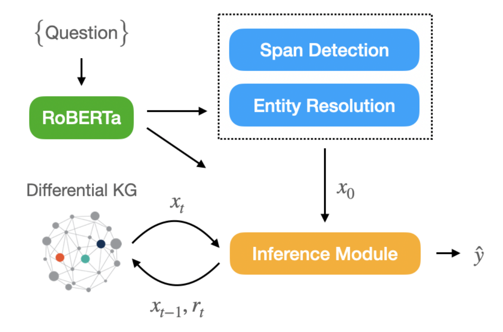
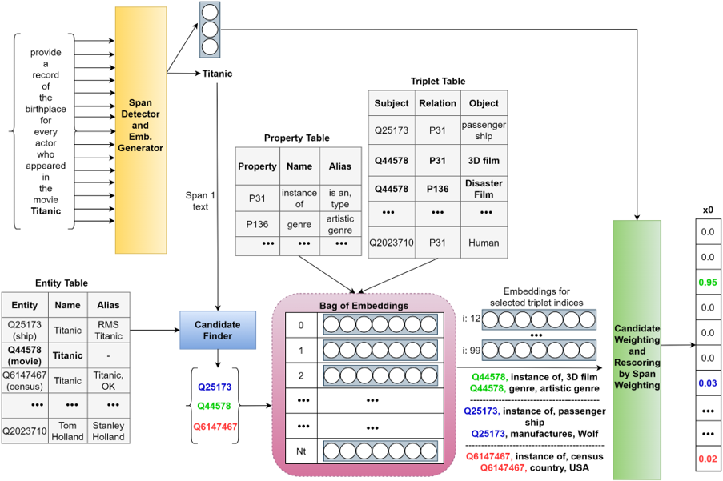
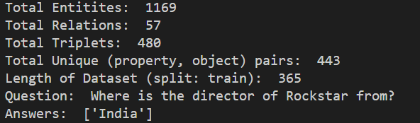

# E2E Knowledge Graph Question Answering
[](https://github.com/edwinthomas444/knowledge-graph-question-answering/blob/main/LICENSE)

## Table of Contents

+ [About](#about)
+ [Getting Started](#getting_started)
    + [Installing the requirements](#installing)
+ [Training](#train)
+ [Inferencing](#inference)
+ [License](#license)

## About <a name = "about"></a>

A PyTorch Implementation of Knowledge Graph Question Answering (KGQA) based on [Amazon Alexa - E2E Entity Resolution and Question Answering](https://aclanthology.org/2021.emnlp-main.345.pdf).

<!--  -->


The RIGEL model consists of two major components:

1. **Entity Resolution:** Detect Spans from Natural Language Queries and ground them to Knowledge Graph entities.

    

2. **Inference Module:** Learn to model relationships to traverse through the Knowlege Graph to obtain answers for the query.

    Inference Module | Example Follow Operation (2-hop)
    --- | ---
     | 

## Getting Started <a name = "getting_started"></a>

### Installing the requirements <a name = "installing"></a>
Clone the repo and install [requirements.txt](./requirements.txt) in a
[**Python>=3.7.0**](https://www.python.org/) environment, including
[**PyTorch>=1.7**](https://pytorch.org/get-started/locally/).

Use the below command to recursively install all the requirements:

```
>> pip install -r requirements.txt
```
## Training <a name = "train"></a>
The config file under `./configs/` is used to set the hyperparameters for model training and checkpoint paths.

To run train use the following command within the environment:

```
python .\train.py --config './configs/base.json'
```

## Inferencing <a name = "inference"></a>
The config file under `./configs/` is used to set the hyperparameters for innitializing model checkpoints and the question to inference.

To run train use the following command within the environment:

```
python .\inference.py --config './configs/base.json'
```

A screenshot of single query inferencing is show below:



## License <a name = "license"></a>

This project is licensed under the MIT License. See the [LICENSE](LICENSE) file for details.
